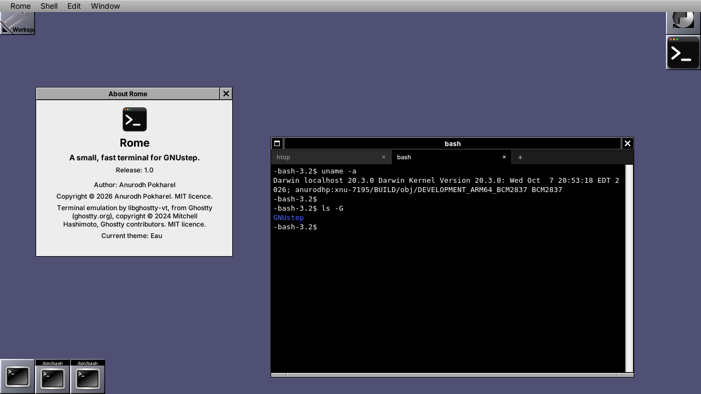

<p align="center"></p>

# Rome

**A small, fast terminal for GNUstep.** Rome is a terminal emulator for the GNUstep desktop, written in C and Objective-C for the Raspberry Pi 3 port of Darwin. It replaces the stock GNUstep Terminal, which is slow enough on that hardware that scrolling output and typing are visibly laggy.

Terminal emulation is done by [libghostty-vt](https://github.com/ghostty-org/ghostty), the library behind the [Ghostty](https://ghostty.org) terminal. Rome adds the pty, the window, the keyboard and mouse, and a renderer that draws only the cells that changed.

## How much faster

Measured on a Raspberry Pi 3 (Cortex-A53, 1 GB) against the GNUstep Terminal it replaces, both started the same way, driving each from the outside:

| | Rome | GNUstep Terminal |
|---|---|---|
| Print 50,000 lines (`seq 1 50000`) | **1.5 s** | 83–97 s |
| CPU used by that | 1.4 s | 78–93 s |
| CPU while idle (30 s at a prompt) | 0.06 s | 0.8–1.1 s |
| Memory (resident) | 29 MB | 111–156 MB |

That is about **55–60× faster** on output, with a fraction of the CPU and memory. Typing is immediate: with a key typed every 50 ms, the time from the keypress to the pixels on screen is **1.0 ms on average** (8.7 ms worst case), measured inside Rome.

How these were taken, and what they do not show:
- Both terminals were launched from an ssh session, which on this system runs at background priority, so timers are slower than for programs started from the desktop. They were treated identically; absolute numbers for either should be better at desktop priority.
- Output speed is bash's `time` around `seq` in each terminal's own shell; CPU is the process's CPU from `ps`.
- I did not get a comparable key-to-pixel number for the old Terminal (the probe needs a clean run on a quiet machine), so the typing figure is Rome's alone. `tools/compare.sh` and `tools/xlatency.c` are the harness; rerun them to reproduce or to add that number.

## Features

- Full xterm-style terminal: 256 colours and true colour, bold / italic / underline / strikethrough, wide characters, alternate screen, bracketed paste, device attribute replies.
- Tabs (Cmd+T new, Cmd+W close, Cmd+Shift+] / [ to switch), and several windows.
- Scrollback with a scroll bar, the mouse wheel and Shift+PageUp/Down; selection by drag, double-click (word) and triple-click (line); copy and paste.
- Mouse reporting for programs that ask for it (vim, htop, less).
- The window and tab title follow the foreground program (`bash`, `htop`, ...), or what the program sets itself.
- Dark theme by default (white on black); `Pro` and `Basic` (black on white) are available.
- Resizes with the window; the shell is told (SIGWINCH).
- Two renderers: the default draws into an MIT-SHM image on the CPU and puts only the changed cells on the screen; `-RomeRenderer gl` uses OpenGL through Mesa.
- Small: a few thousand lines of C and Objective-C.

## Settings

Set as GNUstep defaults or on the command line (`Rome -RomeFontSize 15`):

| Default | What | Default value |
|---|---|---|
| `RomeFont`, `RomeFontSize` | fontconfig family, size in pixels | DejaVu Sans Mono, 13 |
| `RomeColumns`, `RomeRows` | initial size | 80 × 24 |
| `RomeScrollback` | lines kept | 5000 |
| `RomeTheme` | `Dark`, `Pro`, `Basic` | Dark |
| `RomeRenderer` | `x11` or `gl` | x11 |
| `RomeMaxFPS` | frame cap for floods of output | 60 |
| `RomeCursorBlink`, `RomeOptionAsMeta` | | YES |
| `RomeCommand` | run `/bin/sh -c <command>` instead of the login shell | |
| `RomeImmediateRender` | draw small reads at once instead of waiting for the frame timer | YES |

`ROME_STATS=1` prints frame costs, key-to-screen latency and run-loop stalls on exit.

## Building

Rome is cross-built for the Pi with the toolchain and libraries of the [iokit](https://github.com/anurodhp/xnu-iokit-pi3) repository (the Darwin port), as a normal GNUstep application. You need:

- the iokit repository checked out next to this one (`../iokit`, or set `IOKIT_DIR`), with its third-party sources fetched (`./setup_third_party.sh`);
- Xcode 12 (the iPhoneOS SDK the port is built with) and a current Xcode for its linker;
- [Zig](https://ziglang.org) 0.16 (libghostty-vt is Zig; `brew install zig@0.16`);
- the libraries Rome links already built there: libghostty-vt (`tools/userland_staging/build_libghostty_vt.sh`), GNUstep base, gui and back, FreeType, fontconfig, X11 with MIT-SHM, and Mesa's libGL.

Then, from this directory:

```sh
./build.sh            # cross-build; Rome.app lands in iokit's libc_build/gnustep/root
./build.sh deploy     # build, then copy Rome.app and libghostty-vt to the Pi
```

`deploy` uses `DEPLOY_HOST` (default `root@10.0.0.142`).

To build on another system with GNUstep, libghostty-vt (`zig build -Demit-lib-vt=true`), FreeType, fontconfig, Xlib with MIT-SHM and libGL installed:

```sh
make ADDITIONAL_CPPFLAGS="-I/path/to/ghostty/include -I/usr/include/freetype2" \
     ADDITIONAL_LIB_DIRS="-L/path/to/ghostty/lib"
```

### Testing

`tools/term_test.sh` builds libghostty-vt for the host and runs the terminal core (`RomeTerm.c`) against it with a stub renderer: escape sequences in, cells, scrollback, selection, and the bytes sent for keys, mouse, paste and queries out. It needs only Zig and a C compiler, no Pi.

## Layout

| | |
|---|---|
| `RomeTerm.c` | the core: pty, libghostty-vt, frame loop, selection, input encoding |
| `RomeView.m`, `RomeTabs.m`, `main.m` | the AppKit side: window, tabs, scroll bar, input, menus |
| `RomeRenderX11.c`, `RomeRenderGL.c`, `RomeFont.c`, `RomeX.c` | renderers, glyph atlas, the X connection |
| `tools/` | tests and benchmarks: `term_test.sh`, `compare.sh`, `xlatency.c`, `pty_latency.c`, `wake_latency.c`, `sleep_latency.c`, `xwd2png.py` |

## Licence

MIT, see `LICENSE`. libghostty-vt is © Mitchell Hashimoto and the Ghostty contributors, also MIT.
